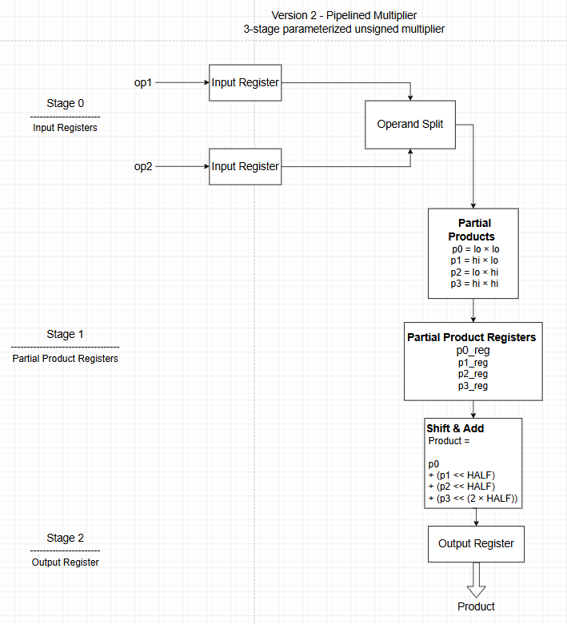
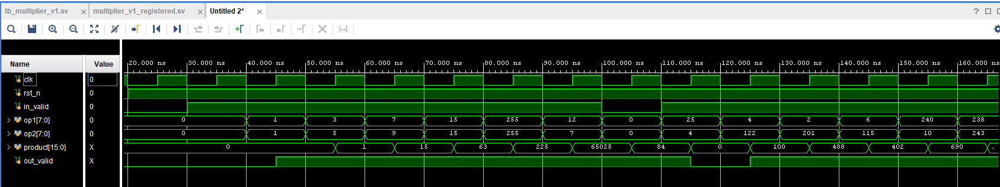
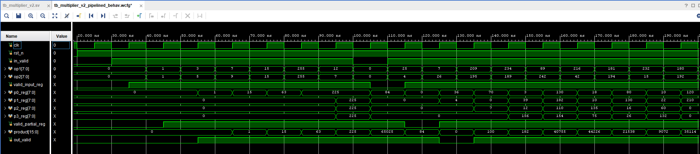
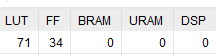
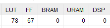
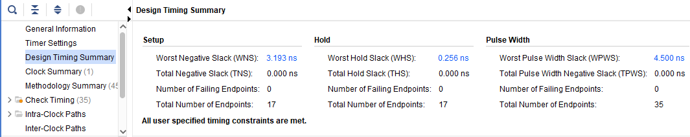
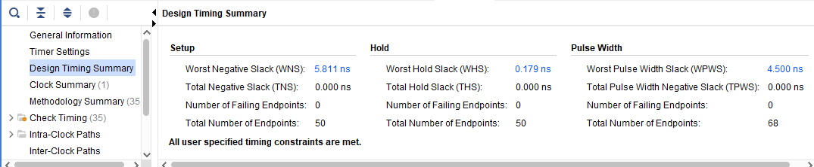

# Pipelined Unsigned Multiplier

## Overview

This project compares two implementations of an unsigned multiplier written in **SystemVerilog**.

The first implementation (**V1**) is a baseline registered multiplier that performs multiplication using the built-in `*` operator.

The second implementation (**V2**) is a pipelined architecture that splits each operand into upper and lower halves, computes four partial products, registers the intermediate results, and combines them using shift-and-add logic.

Both implementations were synthesized and implemented in **Vivado** on a **Basys 3 (Artix-7)** FPGA to compare functionality, resource utilization, and timing performance.

## Architecture



## Architecture Summary

The multiplier is implemented as a three-stage pipeline:

- **Stage 0:** Registers the input operands.
- **Stage 1:** Splits the operands into upper and lower halves, computes the four partial products, and registers the intermediate results.
- **Stage 2:** Combines the partial products using shift-and-add logic and registers the final product.

A pipelined valid signal (`in_valid` → `valid_input_reg` → `valid_partial_reg` → `out_valid`) ensures that the output remains aligned with the corresponding input data.

---

# Target Platform

| Item | Value |
|------------------|-----------------|
|    FPGA Board    |     Basys 3     |
|    FPGA Device   | XC7A35T-1CPG236C|
|       Tool       |  Vivado 2023.2  |
|        HDL       |  SystemVerilog  |
| Clock Constraint | 100 MHz (10 ns) |

---

# Project Structure

```text
01_pipelined_multiplier/
├── rtl/
│   ├── multiplier_v1_registered.sv
│   └── multiplier_v2_pipelined.sv
│
├── tb/
│   ├── tb_multiplier_v1_registered.sv
│   └── tb_multiplier_v2_pipelined.sv
│
├── constraints/
│   └── timing.xdc
│
├── reports/
│   ├── v1_waveform.png
│   ├── v2_waveform.png
│   ├── v1_utilization.png
│   ├── v2_utilization.png
│   ├── v1_timing.png
│   └── v2_timing.png
│
├── images/
│   └── pipeline_architecture.png
│
└── README.md
```

---

# Version 1 – Registered Multiplier

V1 is the baseline implementation.

The operands are first registered, multiplied using the built-in multiplier, and the result is stored in the output register.

### Pipeline

```text
Inputs
   │
   ▼
Input Registers
   │
   ▼
Multiplier
   │
   ▼
Output Register
```

Pipeline stages

- Stage 0 – Input Registers
- Stage 1 – Output Register

---

# Version 2 – Pipelined Partial Product Multiplier

V2 divides each operand into upper and lower halves.

For an 8-bit multiplier

```text
op1 = op1_hi | op1_lo

op2 = op2_hi | op2_lo
```

Four partial products are generated.

```text
p0 = op1_lo × op2_lo

p1 = op1_hi × op2_lo

p2 = op1_lo × op2_hi

p3 = op1_hi × op2_hi
```

The final product is computed as

```text
product =
p0
+ (p1 << HALF)
+ (p2 << HALF)
+ (p3 << (2 × HALF))
```

### Pipeline

```text
Inputs
   │
   ▼
Input Registers
   │
   ▼
Operand Split
   │
   ▼
Partial Product Generation
   │
   ▼
Partial Product Registers
   │
   ▼
Shift and Add
   │
   ▼
Output Register
```

Pipeline stages

- Stage 0 – Input Registers
- Stage 1 – Partial Product Registers
- Stage 2 – Output Register

---

# Pipeline Valid Signal

The valid signal is pipelined together with the data.

```text
in_valid
    │
    ▼
valid_input_reg
    │
    ▼
valid_partial_reg
    │
    ▼
out_valid
```

This ensures that the output data is always aligned with its corresponding valid signal and allows pipeline bubbles to propagate correctly.

---

# Verification

Both implementations use self-checking SystemVerilog testbenches.

The following scenarios were verified.

- Directed test cases
- Boundary values
- Maximum operand values
- Randomized testing
- Pipeline bubble testing
- Valid signal alignment
- Automatic PASS/FAIL checking

The expected multiplication result is pipelined inside the testbench so that it remains aligned with the DUT output.

---

# Simulation Results

## Version 1



---

## Version 2



The V2 waveform illustrates

- Input registration
- Partial product generation
- Partial product registers
- Valid signal propagation
- Final registered product

---

# FPGA Resource Utilization

| Resource | V1 | V2 |
|----------|---:|---:|
| LUTs | **71** | **78** |
| Flip-Flops | **34** | **67** |
| BRAM | **0** | **0** |
| DSP | **0** | **0** |

### Resource Utilization

The pipelined implementation (V2) requires more hardware resources than the baseline implementation (V1).

- LUT usage increased slightly from **71** to **78**.
- Flip-flop usage increased from **34** to **67** because V2 introduces an additional pipeline stage.
- Neither implementation uses DSP blocks or BRAM since the multiplier is implemented entirely using RTL logic.

### Flip-Flop Calculation

The expected flip-flop count for V2 can be calculated directly from the architecture.

```text
Input Registers

op1_reg           = 8
op2_reg           = 8
valid_input_reg   = 1

Subtotal = 17


Partial Product Registers

p0_reg            = 8
p1_reg            = 8
p2_reg            = 8
p3_reg            = 8
valid_partial_reg = 1

Subtotal = 33


Output Registers

product           = 16
out_valid         = 1

Subtotal = 17


Total = 67 Flip-Flops
```

Vivado reported **67 flip-flops**, exactly matching the expected hardware resources.

### Utilization Reports

#### Version 1



#### Version 2



---

# Timing Analysis

| Metric | V1 | V2 |
|---------|---:|---:|
| Worst Negative Slack (WNS) | **+3.193 ns** | **+5.811 ns** |
| Worst Hold Slack (WHS) | +0.256 ns | +0.179 ns |
| Total Negative Slack (TNS) | 0.000 ns | 0.000 ns |
| Timing Violations | 0 | 0 |

Both implementations meet the 100 MHz timing constraint.

The pipelined implementation provides a larger positive setup slack because the combinational logic is distributed across multiple pipeline stages, reducing the critical path delay.

### Timing Reports

#### Version 1



#### Version 2



---

# Design Decisions

Several architectural decisions were made while developing this project.

- Split each operand into upper and lower halves to demonstrate partial-product multiplication.
- Register the partial products to shorten the combinational path.
- Pipeline the valid signal so that control and data remain synchronized.
- Extend partial products before shifting to prevent width truncation.
- Parameterize the design using `WIDTH` to support different operand sizes.

---

# Version Comparison

| Feature | V1 | V2 |
|----------|----|----|
| Pipeline Stages | 2 | 3 |
| Latency | Lower | Higher |
| Throughput | 1 result / cycle | 1 result / cycle |
| LUT Usage | Lower | Slightly Higher |
| Flip-Flop Usage | Lower | Higher |
| Timing Margin | Good | Better |

---

# Key Takeaways

This project demonstrates

- Parameterized RTL design
- Combinational and sequential logic
- Pipeline implementation
- Partial-product multiplication
- Valid signal propagation
- Self-checking verification
- Timing analysis
- FPGA resource analysis
- Area versus timing trade-offs

---

# Future Improvements

Possible extensions include

- Signed multiplication
- DSP48 implementation
- Booth multiplier
- Wallace tree multiplier
- Wider operand support
- Configurable pipeline depth
