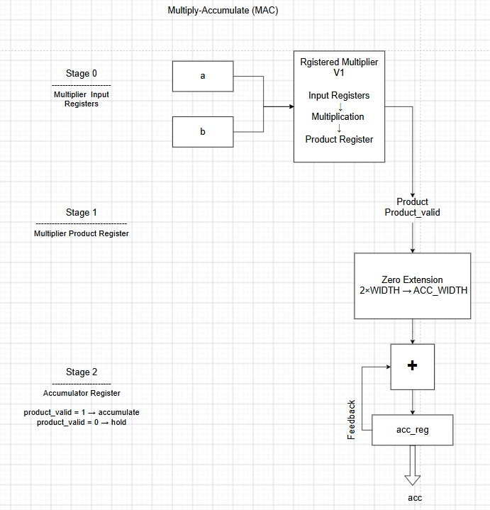
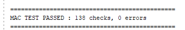
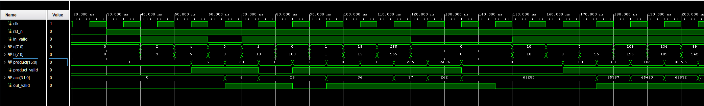
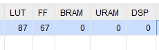
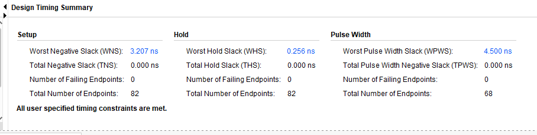

# Multiply-Accumulate (MAC)

## Overview

This project implements a parameterized unsigned **Multiply-Accumulate (MAC)** unit in SystemVerilog.

The MAC reuses the registered multiplier developed in Project 1 and adds an accumulator stage with feedback.

For every valid input pair, the MAC performs:

```text
acc = acc + (a × b)
```

If no valid product is available, the accumulator holds its previous value.

The design was verified using a self-checking SystemVerilog testbench and implemented in Vivado on the Basys 3 (Artix-7) FPGA.

---

## Results at a Glance

| Metric | Result |
|--------|-------:|
| Self-Checking Testbench | **138 checks, 0 errors** |
| LUTs | **87** |
| Flip-Flops | **67** |
| BRAM | **0** |
| DSP Blocks | **0** |
| Worst Negative Slack (WNS) | **+3.207 ns** |
| Worst Hold Slack (WHS) | **+0.256 ns** |
| Timing Violations | **0** |

---

## Architecture



### Architecture Summary

The MAC is implemented as a three-stage pipeline.

- **Stage 0:** Registers the multiplier input operands.
- **Stage 1:** Produces and registers the multiplication result.
- **Stage 2:** Adds the valid product to the previous accumulator value and stores the new accumulated result.

The accumulator output is fed back into the adder so that each valid product is added to the running sum.

The valid path follows:

```text
in_valid
   ↓
multiplier valid register
   ↓
product_valid
   ↓
out_valid
```

When `product_valid = 0`, the accumulator holds its current value.

---

## Parameters

The design is parameterized using:

```systemverilog
parameter WIDTH = 8,
parameter ACC_WIDTH = 4 * WIDTH
```

`WIDTH` controls the operand width.

`ACC_WIDTH` controls the accumulator width and can be configured by the module that instantiates the MAC.

The accumulator width must be large enough to hold the multiplication result:

```text
ACC_WIDTH >= 2 × WIDTH
```

For the implementation used in this project:

```text
WIDTH = 8
ACC_WIDTH = 32
```

---

## Project Structure

```text
02_multiply_accumulate/
├── rtl/
│   ├── mac.sv
│   └── multiplier_v1_registered.sv
│
├── tb/
│   └── tb_mac.sv
│
├── constraints/
│   └── timing.xdc
│
├── images/
│   └── mac_architecture.png
│
├── reports/
│   ├── mac_waveform.png
│   ├── mac_test_pass.png
│   ├── mac_utilization.png
│   └── mac_timing.png
│
└── README.md
```

---

## Hierarchical Design

The MAC reuses the registered multiplier from the previous project.

```text
MAC
│
├── Registered Multiplier V1
│
└── Accumulator
```

The multiplier is instantiated as a submodule inside `mac.sv`.

This keeps the design modular and demonstrates hierarchical RTL design and reuse of previously verified logic.

---

## Accumulator Behavior

A valid multiplier output updates the accumulator:

```text
product_valid = 1

acc_new = acc_old + product
```

During a pipeline bubble:

```text
product_valid = 0
```

the accumulator holds its current value.

For example:

```text
2 × 3  = 6   → acc = 6
4 × 5  = 20  → acc = 26
bubble        → acc = 26
1 × 10 = 10  → acc = 36
```

---

## Product Width Extension

The multiplier produces a `2 × WIDTH`-bit product, while the accumulator can be wider.

For the default parameters:

```text
Multiplier output = 16 bits
Accumulator       = 32 bits
```

The unsigned product is zero-extended to `ACC_WIDTH` before being added to the accumulator.

This avoids relying on implicit width conversion and makes the intended arithmetic width explicit.

---

## Verification

The MAC was verified using a self-checking SystemVerilog testbench.

The testbench includes:

- Directed multiplication and accumulation tests
- Maximum operand values
- Pipeline bubble testing
- Multiple consecutive bubbles
- Accumulator hold verification
- Valid signal alignment
- Randomized inputs
- Automatic PASS/FAIL checking

The testbench completed:

```text
138 checks
0 errors
```

### Test Result



---

## Simulation Waveform



The waveform shows:

- Input operands
- Multiplier product
- `product_valid`
- Running accumulator value
- `out_valid`
- Accumulator hold behavior during bubbles

---

## FPGA Resource Utilization

| Resource | Usage |
|----------|------:|
| LUTs | **87** |
| Flip-Flops | **67** |
| BRAM | **0** |
| URAM | **0** |
| DSP Blocks | **0** |

### Flip-Flop Calculation

The expected flip-flop usage can be estimated from the architecture.

```text
Registered Multiplier V1
= 34 FFs

Accumulator
= 32 FFs

MAC out_valid
= 1 FF

Total
= 34 + 32 + 1
= 67 FFs
```

Vivado reported exactly **67 flip-flops**, matching the expected register count.

### Utilization Report



---

## Timing Analysis

The design was implemented using a:

```text
100 MHz clock
10 ns clock period
```

Vivado reported:

| Metric | Result |
|--------|-------:|
| Worst Negative Slack (WNS) | **+3.207 ns** |
| Total Negative Slack (TNS) | **0.000 ns** |
| Worst Hold Slack (WHS) | **+0.256 ns** |
| Total Hold Slack (THS) | **0.000 ns** |
| Setup Failing Endpoints | **0** |
| Hold Failing Endpoints | **0** |

All user-specified timing constraints were met.

### Timing Report



---

## Design Decisions

Several architectural choices were made while developing the MAC.

- Reuse the registered multiplier from Project 1 instead of duplicating multiplier logic inside the MAC.
- Use a feedback path from the accumulator register to the adder.
- Parameterize both operand width and accumulator width.
- Zero-extend the multiplier result before accumulation.
- Hold the accumulator during invalid cycles rather than clearing it.
- Use a single global reset to clear both the multiplier pipeline and accumulator state.
- Register `out_valid` with the accumulator output so that control and data remain aligned.

---

## What I Learned

This project introduced several concepts beyond the multiplier project:

- Hierarchical RTL design
- Module instantiation
- Reuse of verified RTL blocks
- Stateful hardware
- Feedback datapaths
- Accumulator design
- Pipeline bubble handling
- Parameterized accumulator widths
- Control and data alignment
- Resource estimation from RTL
- Timing analysis of hierarchical designs

---

## Future Improvements

Possible extensions include:

- Signed MAC operation
- Dedicated accumulator clear input
- Saturating arithmetic
- Configurable overflow behavior
- DSP48-based MAC implementation
- Comparison between V1 and V2 multiplier-based MAC architectures
- Integration into an FIR filter
