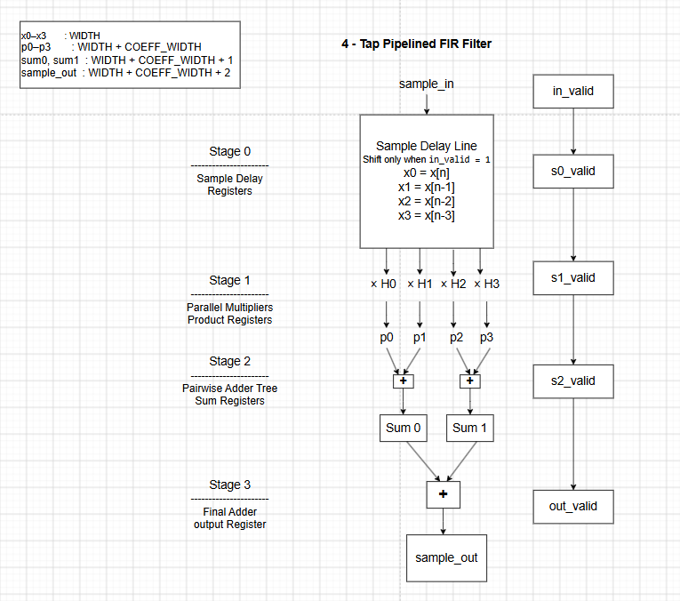
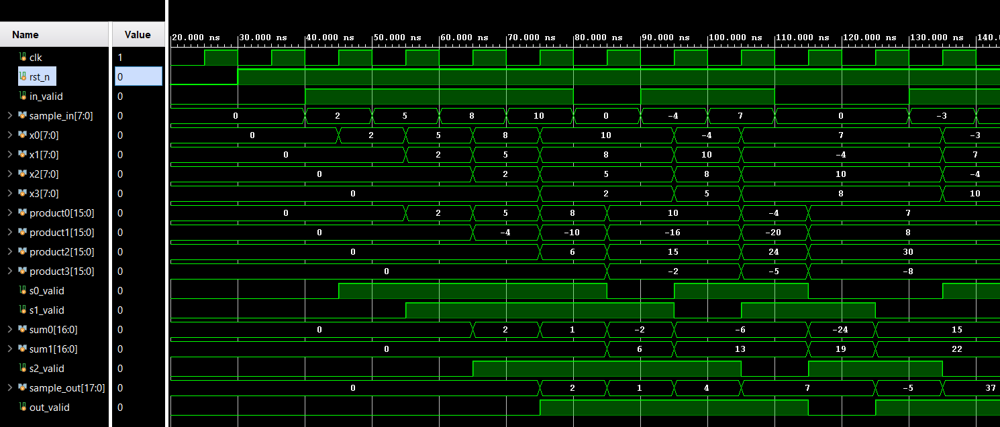
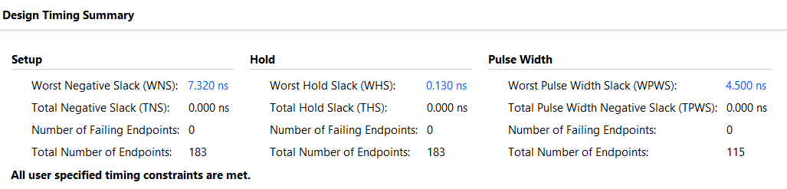
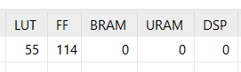

# 4-Tap Pipelined FIR Filter

A parameterized 4-tap Finite Impulse Response (FIR) filter implemented in SystemVerilog and synthesized using AMD/Xilinx Vivado.

The design uses signed arithmetic, four parallel multipliers, a pipelined adder tree, valid-signal propagation, and a valid-controlled input sample delay line.

---

## FIR Equation

The filter implements:

\[
y[n] = H_0x[n] + H_1x[n-1] + H_2x[n-2] + H_3x[n-3]
\]

The default coefficients used in this implementation are:

```text
H0 =  1
H1 = -2
H2 =  3
H3 = -1
```

The coefficients are parameterized and can be changed without modifying the datapath architecture.

---

## Architecture

The FIR datapath is divided into four pipeline stages.



### Stage 0 — Sample Delay Registers

The input history is stored in four signed registers:

```text
x0 = x[n]
x1 = x[n-1]
x2 = x[n-2]
x3 = x[n-3]
```

The sample history shifts only when:

```text
in_valid = 1
```

When `in_valid = 0`, the existing sample history is preserved.

This prevents bubbles in the input stream from incorrectly shifting the FIR history.

---

### Stage 1 — Parallel Multipliers

Four signed multiplications are performed in parallel:

```text
p0 = x0 × H0
p1 = x1 × H1
p2 = x2 × H2
p3 = x3 × H3
```

The four multiplication results are registered before entering the adder tree.

Using four multipliers in parallel allows the design to maintain high throughput.

---

### Stage 2 — Pairwise Adder Tree

The four products are reduced using two additions in parallel:

```text
sum0 = p0 + p1
sum1 = p2 + p3
```

Both results are registered.

Using a balanced adder tree reduces the amount of combinational logic between pipeline registers compared with adding all four products sequentially.

---

### Stage 3 — Final Adder

The final FIR result is calculated as:

```text
sample_out = sum0 + sum1
```

The final result is stored in the output register.

---

## Valid Pipeline

The valid signal propagates alongside the corresponding sample through the complete datapath:

```text
in_valid
   ↓
s0_valid
   ↓
s1_valid
   ↓
s2_valid
   ↓
out_valid
```

The valid pipeline keeps the output-valid signal aligned with the associated FIR result.

It also allows bubbles to propagate through the pipeline without corrupting previously accepted samples.

---

## Datapath Widths

The design accounts for arithmetic bit growth throughout the datapath.

For:

```text
Input width       = WIDTH
Coefficient width = COEFF_WIDTH
```

the internal widths are:

```text
x0–x3       = WIDTH

p0–p3       = WIDTH + COEFF_WIDTH

sum0–sum1   = WIDTH + COEFF_WIDTH + 1

sample_out  = WIDTH + COEFF_WIDTH + 2
```

Sign extension is performed before widening additions so that negative values are handled correctly.

---

## Parameters

The RTL is parameterized for both sample width and coefficient width.

```systemverilog
parameter integer WIDTH       = 8,
parameter integer COEFF_WIDTH = 8,

parameter signed [COEFF_WIDTH-1:0] H0 =  1,
parameter signed [COEFF_WIDTH-1:0] H1 = -2,
parameter signed [COEFF_WIDTH-1:0] H2 =  3,
parameter signed [COEFF_WIDTH-1:0] H3 = -1
```

This allows the same architecture to be reused with different datapath widths and FIR coefficients.

---

## Pipeline Latency

A valid input sample is captured in Stage 0.

The corresponding result progresses through the pipeline as follows:

```text
Edge 0 → Input sample accepted into delay line
Edge 1 → Products registered
Edge 2 → Pairwise sums registered
Edge 3 → Final FIR result registered
```

Therefore:

```text
Latency = 3 clock cycles from accepted input to valid output
```

The design has an initiation interval of:

```text
II = 1
```

so it can accept one valid input sample every clock cycle.

Once the pipeline is filled, one valid output can also be produced every clock cycle for continuous valid input traffic.

---

## Verification

A self-checking SystemVerilog testbench was developed to verify the FIR filter.

The testbench covers:

- Directed input sequences
- Positive signed values
- Negative signed values
- Consecutive valid samples
- Input-valid bubbles
- Multiple consecutive bubbles
- Minimum and maximum signed input values
- Randomized input samples
- Automatic expected-value checking

The reference model maintains its own input history and computes:

```text
expected =
    sample_in × H0
  + previous_sample_1 × H1
  + previous_sample_2 × H2
  + previous_sample_3 × H3
```

The reference history advances only when `in_valid = 1`, matching the behavior of the RTL delay line.

---

## Example Calculation

Using:

```text
H0 =  1
H1 = -2
H2 =  3
H3 = -1
```

and the input sequence:

```text
2, 5, 8, 10
```

the first outputs are:

```text
2
1
4
7
```

For example:

```text
y[0] = 1(2)
     = 2
```

```text
y[1] = 1(5) - 2(2)
     = 1
```

```text
y[2] = 1(8) - 2(5) + 3(2)
     = 4
```

```text
y[3] = 1(10) - 2(8) + 3(5) - 1(2)
     = 7
```

---

## Simulation Results

The simulation waveform verifies:

- Sample-delay behavior
- Parallel multiplication
- Pairwise summation
- Final accumulation
- Signed arithmetic
- Pipeline timing
- Valid-signal propagation
- Correct behavior during bubbles



The self-checking testbench automatically compares DUT results against the reference FIR model.

---

## FPGA Implementation

The FIR filter was synthesized and implemented using AMD/Xilinx Vivado.

### Clock Constraint

The FPGA design uses the following XDC timing constraint:

```tcl
create_clock -period 10.000 -name clk [get_ports clk]
```

This corresponds to a target clock frequency of:

```text
100 MHz
```

---

## Timing Results

Vivado timing analysis reported:

```text
Worst Negative Slack (WNS): +7.320 ns
Total Negative Slack (TNS): 0 ns
```

The positive WNS and zero TNS confirm that the implementation meets the specified 100 MHz timing requirement.



---

## Resource Utilization

Vivado implementation reported:

```text
LUTs : 55
FFs  : 114
DSPs : 0
BRAM : 0
URAM : 0
```



### Why DSP Usage Is Zero

Although the FIR contains four multiplications, the coefficients are constants:

```text
1
-2
3
-1
```

Vivado can optimize these operations using combinations of:

- Wiring
- Shifts
- Additions
- Subtractions
- LUT logic

As a result, dedicated FPGA DSP blocks were not required for this implementation.

---

## Repository Structure

```text
03_fir_filter/
├── constraints/
│   └── timing.xdc
│
├── images/
│   └── fir_filter_architecture.png
│
├── reports/
│   ├── fir_filter_timing.png
│   ├── fir_filter_utilization.png
│   └── fir_filter_waveform.png
│
├── rtl/
│   └── fir_filter.sv
│
├── tb/
│   └── tb_fir_filter.sv
│
└── README.md
```

---

## Key Concepts Demonstrated

This project demonstrates:

- SystemVerilog RTL design
- Parameterized hardware
- Signed arithmetic
- FIR filter architecture
- Sample delay lines
- Parallel multipliers
- Pipelined arithmetic
- Balanced adder trees
- Pipeline registers
- Valid-signal propagation
- Bubble handling
- Bit-width growth
- Sign extension
- Latency and throughput analysis
- Self-checking testbenches
- Directed verification
- Randomized verification
- Waveform debugging
- FPGA synthesis and implementation
- XDC timing constraints
- Static timing analysis
- FPGA resource-utilization analysis

---

## Tools

- SystemVerilog
- AMD/Xilinx Vivado
- Vivado Simulator
- XDC timing constraints

---

## Project Status

**Complete**

The RTL, verification environment, FPGA implementation, timing analysis, utilization analysis, waveform results, and architecture documentation have all been completed.
